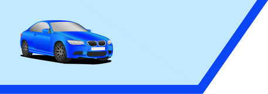

# Car Counter
A computer vision project to count cars in a video feed using YOLOv8 and the SORT tracking algorithm.

## Description
This project uses YOLOv8 (`yolov8l.pt`) to detect and count vehicles (cars, trucks, buses, and motorbikes) in a video feed. It includes a sorting algorithm (`sort.py`) for tracking vehicles across frames. I built this to learn the basics of object detection and tracking as part of my computer vision journey.

## How It Works
- **Detection**: The YOLOv8 model (`yolov8l.pt`) detects vehicles in each frame of the video.
- **Masking**: A mask (`mask.png`) is applied to focus detection on a specific region (e.g., a lane). This reduces false positives by ignoring areas outside the region of interest.
- **Tracking**: The SORT algorithm tracks detected vehicles across frames, assigning each vehicle a unique ID.
- **Counting**: A line is drawn on the video (defined by `limits = [400, 297, 673, 297]`). When a vehicle’s center crosses this line, it’s counted, and the ID ensures it’s not counted again.
- **Visualization**: The video feed shows:
  - Bounding boxes around detected vehicles with their tracking IDs.
  - A red line where counting occurs.
  - The total count of vehicles in the top-left corner.
  - An overlay image (`graphics.png`) for additional visualization (e.g., a background or logo).

## Requirements
- Python 3.x
- Install dependencies:
- Key libraries: `ultralytics`, `opencv-python`, `cvzone`, `numpy`.
- YOLOv8 weights: The script uses `yolov8l.pt`, which is not included due to its size. Download it from the [Ultralytics YOLOv8 repository](https://github.com/ultralytics/ultralytics) and place it in the `Yolo-weights` folder.
- Video file: Download the sample video [here](https://drive.google.com/file/d/1jfXf3ErZo2mz-DvEnxVct7n9W-GFkCtR/view?usp=sharing) and place it in the `videos` folder as `cars1.mp4`.

## How to Run
1. Clone this repo: git clone https://github.com/yassine-work/car-counter-cv.git
2. Navigate to the folder
3. Install the required dependencies: pip install -r requirements.txt
4. Download the sample video and YOLO weights (see Requirements) and place them in the correct folders.
5. Run the script: python CarCounter.py
- The script uses `videos/cars1.mp4` by default. If you use a different video, you’ll need to create a new mask (see below).

## About the Mask
- The `mask.png` file is a binary mask (white for the region of interest, black elsewhere) specific to `cars1.mp4`. It focuses detection on a specific lane to improve accuracy.
- **To Use a Different Video**:
1. Replace `videos/cars1.mp4` with your video file.
2. Update the video path in `CarCounter.py` (line: `cap = cv2.VideoCapture("../videos/cars1.mp4")`).
3. Create a new mask:
  - Use OpenCV to display a frame of your video.
  - Draw a white region of interest (ROI) where cars should be counted (e.g., a lane) on a black background.
  - Save the mask as `mask.png` in the project folder.
- Alternatively, modify `CarCounter.py` to not use a mask by removing the `cv2.bitwise_and(img, mask)` line if you don’t need one.

## Example Output
Below is an example of the car counter in action using `cars1.mp4`:

You can download the sample video [here](https://drive.google.com/file/d/1jfXf3ErZo2mz-DvEnxVct7n9W-GFkCtR/view?usp=sharing) to see the exact setup.

- `graphics.png`: An overlay image used for visualization (e.g., a background or logo).
- `mask.png`: The mask used to focus detection on a specific region.

## Notes
- This is a beginner project—expect some rough edges!
- The counting line (`limits = [400, 297, 673, 297]`) and mask are tuned for `cars1.mp4`. You may need to adjust these for a different video.
- The script can be modified to use a webcam by uncommenting the webcam code (`cap = cv2.VideoCapture(1)`) and commenting out the video file line.

## Example Output
Watch a demo video of the car counter [here](https://drive.google.com/file/d/1ruZ7GLYsP8dR5Ulhbxh7OjAJm1S-dg0V/view?usp=sharing)
